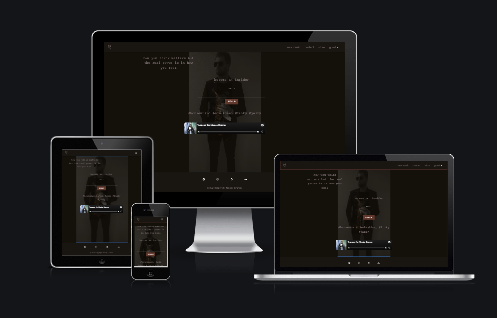
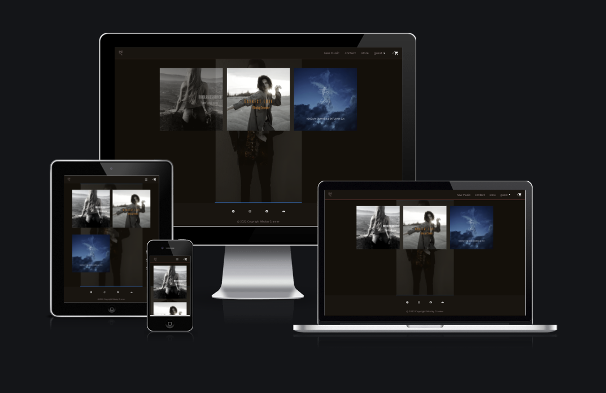
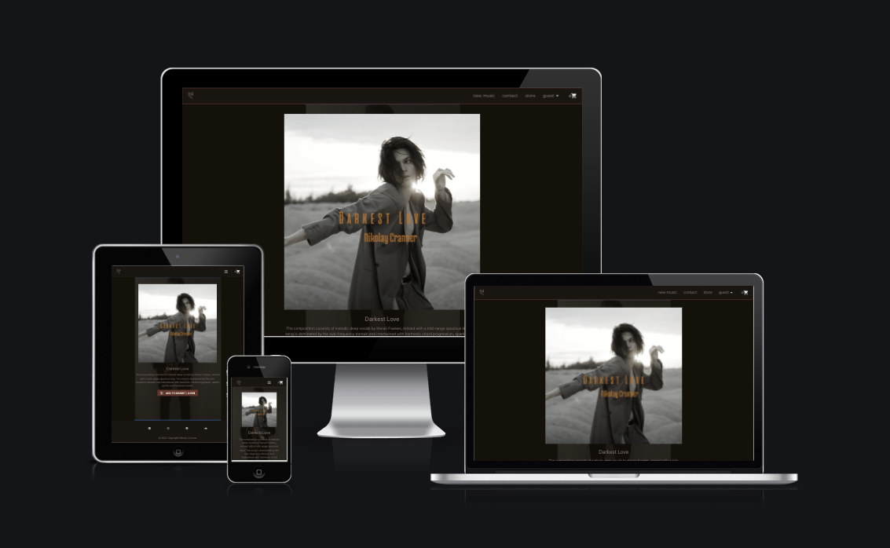
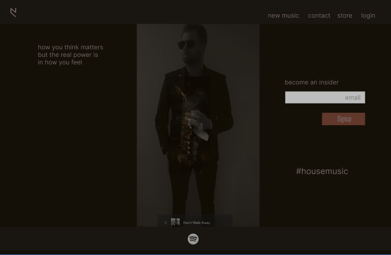
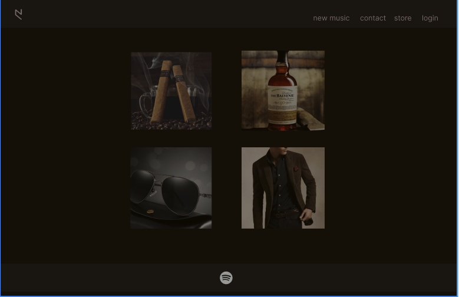
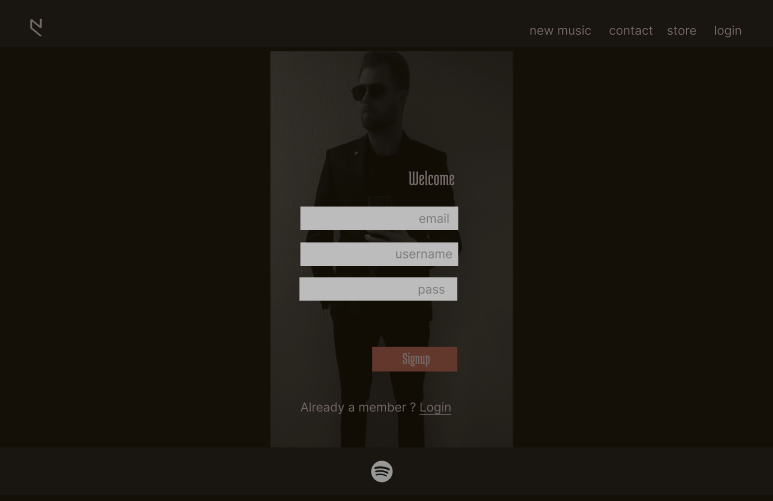
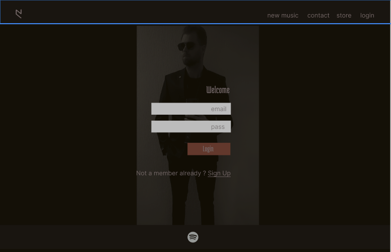
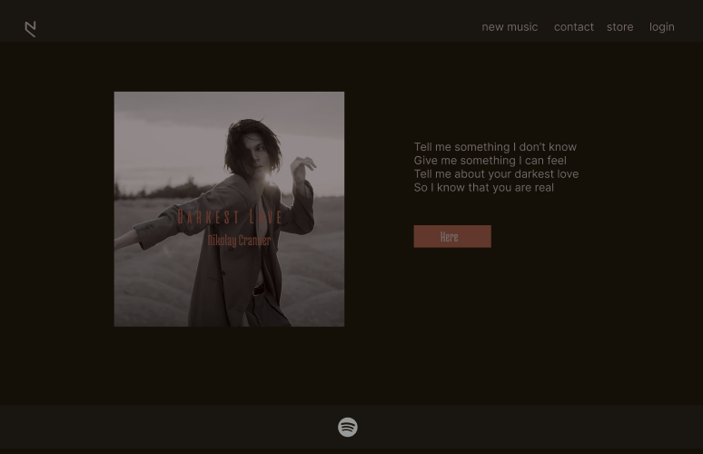
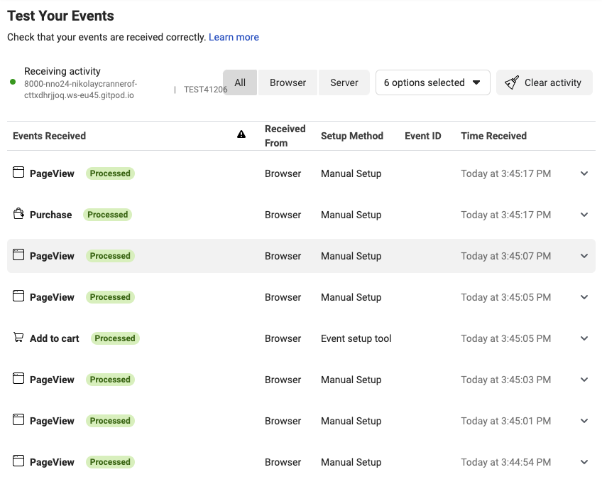
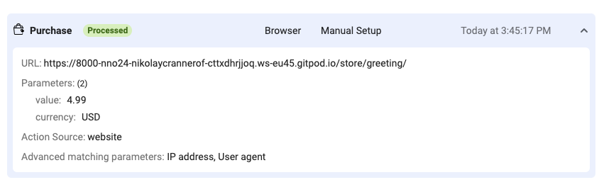

<h1 align="center">Nikolay Cranner Official</h1>

[View the live project here.](https://nikolaycranner.herokuapp.com/)

This is the official page for Nikolay Cranner. It is designed to be responsive and accessible on a range of devices, making it easy to navigate.
The page offers role base authentication, including admin manage privileges for inventory of the store. If a user is not authenticated, it's default user id will be guest. The site have a webstore where customers can purchase music via paypal with the possibility to download the song(s) after successful purchase, and for authenticated users it also offers a profile page where the user can view previous orders and its contents. Login and signup is found in the menu, and for this allauth
is used with email verification as the signup process. Real emails are pushed out to the user tha signs up to the page. NOTE check the spam filter, cause domain priority is not considered in this project ( yet ). The user also have the ability to remove products from shopping bag before purchase. The orders are stored on the postgres server. So that the user can find back to this any time, while logged in. NOTE: if more guest users are trying to shop at the time, the system is not good at handing this at the moment, because the user id will be guest for all users. To be improved in the future.

It's also possible to signup to the newsletter, and the admin user can push out newsletters to the subscribers from a menu item
only accessible to the admin. Real emails are pushed out. Have not implemented a way to unsubscribe yet.

<h2 align="center">
    
    
    
</h2>

## User Experience (UX)
-   ### User stories

    -  [Jira User Stories](https://nno24.atlassian.net/jira/software/c/projects/NCO/boards/1?selectedIssue=NCO-10&atlOrigin=eyJpIjoiMWMyZmRlZTdiMjMxNGEyNzhlMmE4NDkyMmRiZmFkNWYiLCJwIjoiaiJ9)

-   ### Design
    -   #### Colour Scheme
        -   The three main colours used are brown, darker brown, black, and white. The css uses the materializecss css library.
    -   #### Typography
        -   Uses the materializecss standard fonts.
    -   #### Imagery
        -   Proprietary Nikolay Cranner images, permission granted for artwork an other

        #### Media
        -  When purchasing a song, it's possible to download a test sample to illustrate functionality.

        #### Social Media
        -  The footer has all social media links with icons making it easy for the user to click
        and follow. The icons used are from fontawesome.
    <h2 id="wireframes"></h2>
-   ### Wireframes/Mockup
-   <h2 align="center">
    
    
    
    
    
</h2>


## Features

-   Store whre user can purchase music, and get a download oppurtunity after purchase. Checkout with paypal.

-   Role based authentication

-   The admin user can manage the inventory, and crete newsletter when logged in it's accesible from the menu

-   Users can signup of login, and view their order history if logged in

-   Responsive on all devices


## Features to be added/fixed
-   When anonymous user is purchasing products, it's not working good if more anonymous users are shopping at the same time.
    Each anonymous user have the user_id of "guest", and this should be fixed to a unique user id. ( could be done via cookie consent dialouge )
-   The users can not unsubscribe to newsletters
-   Missing cookie consent dialouge
-   Add more products to inventory etc.

## Technologies Used

### Languages Used

-   [HTML5](https://en.wikipedia.org/wiki/HTML5)
-   [CSS3](https://en.wikipedia.org/wiki/Cascading_Style_Sheets)
-   [JavaScript](https://www.javascript.com/about)
-   [Python](https://www.python.org/)

### Frameworks, Libraries & Programs Used
1. [django](https://www.djangoproject.com/)
    - Django is a high-level Python fullstack web framework that was used for implementing the MVC.
1. [heroku:](https://dashboard.heroku.com/)
    - Used for production, hosting service for the app with the postgresql
1. [AWS:](https://aws.amazon.com/)
    - AWS was used to host the static files, like custom css, javascript and media files with S3 buckets.
1. [Materializecss:](https://materializecss.com/)
    - Materializecss was used for css and date/time pickers.
1. [Meta conversion tracking:](https://developers.facebook.com/docs/meta-pixel/implementation/conversion-tracking)
    - Was used for tracking payments, and site activity against meta pixel attached to the facebook business account.  
   <h2 align="center">
        
        
    </h2>
1. [django-allauth:](https://pypi.org/project/django-allauth/)
    - Was used for login, signup authentication, templates was customised to fit webpage design/style.
1. [PayPal SDK:](https://developer.paypal.com/home)
    - Was used for payments on checkout, see Testing section for details
1. [Fontawesome:](https://fontawesome.com/)
    - Fontawesome was used for icons in the socials section in the footer
11. [Git](https://git-scm.com/)
    - Git was used for version control by utilizing the Gitpod terminal to commit to Git and Push to GitHub.
1. [GitHub:](https://github.com/)
    - GitHub is used to store the projects code after being pushed from Git.
1. [GitPod:](https://gitpod.io/)
    - GitPod is used as the IDE for the project.
1. [Chrome-DevTools:](https://developer.chrome.com/docs/devtools/)
    - Chrome DevTools was used to test responsiveness on all devices,to inspect html/css, and to debug the application.
1.  [Am I Responsive?](http://ami.responsivedesign.is/)
    - Am I Responsive? was used to create the screenshot of the website for all devices, the first image of the README.


## Testing
A combination of manual test steps and automatic tests have been implemented.
### Automatic tests
Automatic tests have been written for all custom models, and some view test's for the front-end.
The model's testing is utilizing the TestCase class in python. The view test's are using [selenium](https://www.selenium.dev/documentation/)
in headless mode. [Coverage](https://coverage.readthedocs.io/en/6.4.1/) is used for running the tests, and to generate a html report of
the total coverage of automatic tests across the entire application. The testing is done in gitpod during development, but can work for 
any other IDE as well. Headless mode was necessary because the docker image used in gitpod during development was not graphical, but a graphical image could
obtained from gitpod. Each app have a tests.py file, this is where the tests are located.

#### Test procedure in gitpod
1. Install Firefox:
```
$ sudo apt update && sudo apt install firefox
```
2. Install coverage
```
$ pip3 install coverage
```
3. Obtain a [GH_TOKEN](https://docs.github.com/en/authentication/keeping-your-account-and-data-secure/creating-a-personal-access-token) in your github
This is needed to not exceed the API rate limit for selenium.
Add this token to your env.py file. env.py is loded in settings.py

4. Run the tests for each app or all in one
```
$ coverage run manage.py test -v 2
or
$ coverage run manage.py test appname -v 2
```


### Manual testing
#### Newsletter
1. Access the ["website"](nikolaycranner.com) 
2. Try signing up to the newsletter
    1. Success message
3.  Try signing up to the newsletter with the same email
    1. Error message saying "You are already subscribed
4. Login as superuser, create a newsletter
    1. A list of all receipients presented, and success message
    2. The subscriber in step 3 have received a new message
    3. The email shall contain an unsubscribe link
5. Click the unsubscribe link in the email
    1. You are unsubscribed
6. Sign up for the newsletter again, with the same email
    2. Success message, but saying welcome back instead.

#### Contact
1. Login as superuser, and access the admin app
Create some more UserMessageOwner's with example emails, or accounts you have access to.
Enter UserMessageOwnerGroups, and add the emails you defined in UserMessageOwner's, save.

The purpose of this classes, is to define who will receive the email if a user sends a message from the contact form.
Also, the receipients will depend on the topic selected in the contact form.

2. Go to the [contact section](nikolaycranner.com/contact)
    1. A contact form is present
3. Fill out the contact form with the same email as in the Newsletter test.
    Check yes for Newsletter signup, and press Send.
    1. Two messages: 1) Successfully sent 2) Already subscribed ( if you resubscribed in the previous test)
    2. Autoreply received for the email set in the contact form
    3. Receipients in the UserMessageOwnersGroup received the email message.
    4. Redirected to home page.

#### Store

1. Signup as a new user, and login
    1. Your username is reflected in the app
2. Go to store, add some products to the bag.
    Try removing and adding some items.
    1. Bag is updated in the top navigation bar, with the corect quantity.
3. Access the bag by click on it
    1. A summary page is showing your order, and grand total
4. Checkout with paypal
    - NOTE: For testing purposes with paypal checkout and sandbox, use the following:
    - user: sb-h8kdy16271303@personal.example.com
    - pass: Ofkk^(5>

    1. Landing page with successful payment
5. Hit view my order
    1. A summary of the order, and a download button is present
6. Hit the download button
    1. The file is downloaded for each product
    - NOTE: Only example snippet exist on all products ( so far )

7. Enter profile from the main menu
    1. A summary of all orders are listed for your user
8. Enter some of the orders from View button
    1. The order is displaying the products, and contains download posibility

#### General
1. Try entering an invalid like [somerandom](nikolaycranner.com/somerandom) within the main dns
    1. Custom 404 matching the site.
1. Try the above steps on various devices.
    1. Responsive and UX friendy on all devices.


## Deployment

### Heroku

The project was deployed to Heroku using the following steps...

1. Signup to heroku
2. Created the appname
3. Added environment variables and heroku postgresql
4. Attached the git repo to heroku, under deploy tab.
5. Deployed from heroku web interface

### Forking the GitHub Repository

By forking the GitHub Repository we make a copy of the original repository on our GitHub account to view and/or make changes without affecting the original repository by using the following steps...

1. Log in to GitHub and locate the [GitHub Repository](https://github.com/nno24/nikolay-cranner-official)
2. At the top of the Repository (not top of page) just above the "Settings" Button on the menu, locate the "Fork" Button.
3. You should now have a copy of the original repository in your GitHub account.

### Making a Local Clone

1. Log in to GitHub and locate the [GitHub Repository](https://github.com/nno24/nikolay-cranner-official)
2. Under the repository name, click "Clone or download".
3. To clone the repository using HTTPS, under "Clone with HTTPS", copy the link.
4. Open Git Bash
5. Change the current working directory to the location where you want the cloned directory to be made.
6. Type `git clone`, and then paste the URL you copied in Step 3.

```
$ git clone https://github.com/nno24/nikolay-cranner-official
```

7. Press Enter. Your local clone will be created.

```
$ git clone https://github.com/nno24/nikolay-cranner-official
> Cloning into `CI-Clone`...
> remote: Counting objects: 10, done.
> remote: Compressing objects: 100% (8/8), done.
> remove: Total 10 (delta 1), reused 10 (delta 1)
> Unpacking objects: 100% (10/10), done.
```

Click [Here](https://help.github.com/en/github/creating-cloning-and-archiving-repositories/cloning-a-repository#cloning-a-repository-to-github-desktop) to retrieve pictures for some of the buttons and more detailed explanations of the above process.

## Credits
1. Awesome django documentation
2. Stackoverflow at times, and some youtube videos came handy to get django more in the fingers.

### Code

-   Images and media files are proprietary files from Nikolay Cranner, and have the permission to use.


### Content

-   All content was written by the developer.

### Media

- N/A

### Acknowledgements

-   My Mentor [Precious Ijege](https://www.linkedin.com/in/precious-ijege-908a00168/?originalSubdomain=ng) for continuous helpful feedback.

-   Tutor support at Code Institute for their support.
